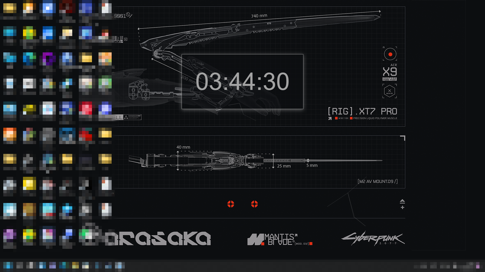

# 赛博时钟 —— 一个简单的网页时钟

### HTML+JS([Vue.js](https://github.com/vuejs/vuex)+[canvas-nest.js](https://github.com/hustcc/canvas-nest.js))

效果图：

## 原本是作为动态桌面制作，已经上架[Steam创意工坊](https://steamcommunity.com/sharedfiles/filedetails/?id=2574289864)。

